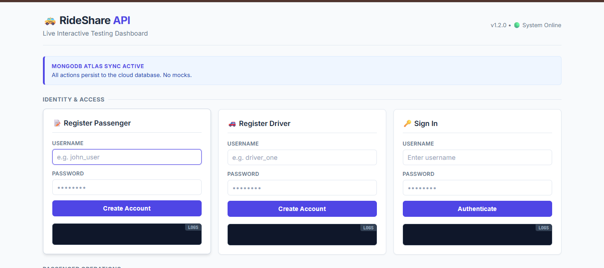
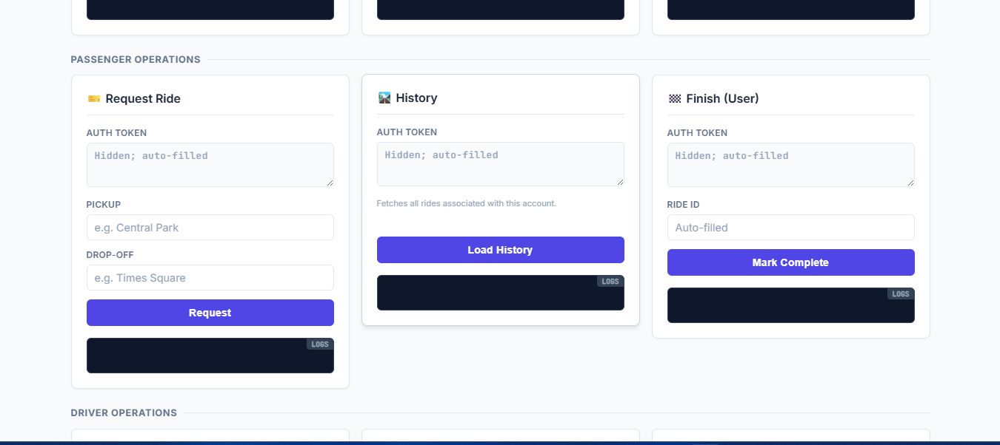
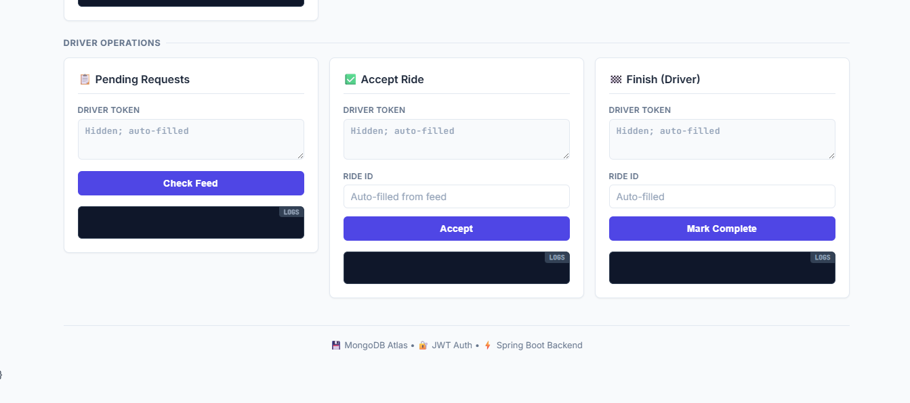

# 🚀 RideShare Backend API

A comprehensive ride-sharing backend application built with **Spring Boot**, **MongoDB**, and **JWT Authentication**.

## 📋 Table of Contents
- [Features](#-features)
- [Technology Stack](#-technology-stack)
- [Prerequisites](#-prerequisites)
- [Project Structure](#-project-structure)
- [Setup Instructions](#-setup-instructions)
- [API Endpoints](#-api-endpoints)
- [Testing with CURL](#-testing-with-curl)
- [Entity Relationships](#-entity-relationships)

## ✨ Features

✔️ **User Authentication** - Register and login with JWT tokens  
✔️ **Role-Based Access Control** - USER and DRIVER roles  
✔️ **Ride Management** - Request, accept, and complete rides  
✔️ **Input Validation** - Jakarta Bean Validation  
✔️ **Global Exception Handling** - Consistent error responses  
✔️ **MongoDB Integration** - NoSQL database for scalability  
✔️ **BCrypt Password Encoding** - Secure password storage  

## 🛠 Technology Stack

- **Java 17**
- **Spring Boot 3.2.0**
- **Spring Security** with JWT
- **Spring Data MongoDB**
- **Lombok** (reduce boilerplate)
- **Jakarta Validation**
- **Maven**

## 📦 Prerequisites

Before running this application, ensure you have:

1. **Java 17** or higher installed
   - Download from: https://www.oracle.com/java/technologies/downloads/#java17
   - Or use OpenJDK: https://adoptium.net/
   - Verify installation: `java -version`
   
2. **Maven** - Already included via Maven Wrapper (`mvnw.cmd`)
   
3. **MongoDB Atlas Account** (Cloud - No Installation Required) ☁️
   - Free cloud MongoDB service at https://www.mongodb.com/cloud/atlas/register

## 📁 Project Structure

```
src/main/java/org/example/rideshare/
├── config/                  # Security and JWT filter configuration
│   ├── JwtAuthenticationFilter.java
│   └── SecurityConfig.java
├── controller/              # REST API endpoints
│   ├── AuthController.java
│   └── RideController.java
├── dto/                     # Data Transfer Objects with validation
│   ├── AuthResponse.java
│   ├── CreateRideRequest.java
│   ├── ErrorResponse.java
│   ├── LoginRequest.java
│   └── RegisterRequest.java
├── exception/               # Custom exceptions and global handler
│   ├── BadRequestException.java
│   ├── GlobalExceptionHandler.java
│   └── NotFoundException.java
├── model/                   # MongoDB entities
│   ├── Ride.java
│   └── User.java
├── repository/              # MongoDB repositories
│   ├── RideRepository.java
│   └── UserRepository.java
├── service/                 # Business logic
│   ├── RideService.java
│   └── UserService.java
└── util/                    # JWT utility
    └── JwtUtil.java
```

## 🚀 Setup Instructions

### 1. Clone the Repository
```bash
git clone https://github.com/raghav095/RIDE-share.git
cd rideshare_app
```

### 2. Configure MongoDB Atlas

1. Create a free account at https://www.mongodb.com/cloud/atlas/register
2. Create a new cluster (M0 Free tier is sufficient)
3. Create a database user with username and password
4. Click "Connect" → "Connect your application" and copy the connection string
5. Add your IP to Atlas Project IP Access List (Network Access). For local dev you may use 0.0.0.0/0 (not recommended for production).
6. Provide configuration via environment variables (loaded automatically at runtime):

  - `MONGODB_URI` → your Atlas connection string
  - `MONGODB_DATABASE` → e.g., `springbootapplication`
  - `JWT_SECRET` → a secure random string
  - `JWT_EXPIRATION` → token TTL in ms (default 86400000)
  - `SERVER_PORT` → e.g., `8081`

  You can set these in a `.env` file at the project root or via your shell/host environment.

### 3. Build the Project
```powershell
.\mvnw.cmd clean package -DskipTests
```

### 4. Run the Application
```powershell
.\mvnw.cmd spring-boot:run
```

Or run the packaged jar:
```powershell
java -jar .\target\rideshare-0.0.1-SNAPSHOT.jar
```

The application will start on **http://localhost:8081**

## 📡 API Endpoints

### Authentication Endpoints (Public)

| Method | Endpoint | Description | Access |
|--------|----------|-------------|--------|
| POST | `/api/auth/register` | Register a new user | Public |
| POST | `/api/auth/login` | Login and get JWT token | Public |

### User Endpoints (Requires ROLE_USER)

| Method | Endpoint | Description | Access |
|--------|----------|-------------|--------|
| POST | `/api/v1/rides` | Request a new ride | ROLE_USER |
| GET | `/api/v1/user/rides` | Get all rides for logged-in user | ROLE_USER |

### Driver Endpoints (Requires ROLE_DRIVER)

| Method | Endpoint | Description | Access |
|--------|----------|-------------|--------|
| GET | `/api/v1/driver/rides/requests` | View all pending ride requests | ROLE_DRIVER |
| POST | `/api/v1/driver/rides/{rideId}/accept` | Accept a ride request | ROLE_DRIVER |

### Shared Endpoints (USER or DRIVER)

| Method | Endpoint | Description | Access |
|--------|----------|-------------|--------|
| POST | `/api/v1/rides/{rideId}/complete` | Mark a ride as completed | USER or DRIVER |

## 🧪 Testing the API

### Option 1: Using the Interactive Web Dashboard (Recommended for Testing)

**This HTML page works on ANY machine** – just start the app and open your browser.

1. Start the application:
  ```bash
  .\mvnw.cmd spring-boot:run
  ```

2. Open in your browser: **http://localhost:8081**

3. You'll see a clean Indigo dashboard with:
  - 📝 Register users & drivers
  - 🔑 Login and get JWT tokens
  - 🎫 Request rides (passenger)
  - 📋 View pending rides (driver)
  - ✅ Accept rides (driver)
  - 🏁 Complete rides
  - 🛣️ View ride history

**Highlights:**
- ✅ Responsive, mobile-friendly layout
- ✅ Real-time API responses in a console-style output
- ✅ Tokens auto-filled into related forms to speed testing
- ✅ Live data persists directly to MongoDB Atlas

#### Dashboard Screenshots

**Identity & Access Section**  


**Passenger Operations**  


**Driver Operations**  


### Option 2: Using CURL (Command Line Testing)

### 1. Register a User (Passenger)
```bash
curl -X POST http://localhost:8081/api/auth/register ^
-H "Content-Type: application/json" ^
-d "{\"username\":\"john\",\"password\":\"1234\",\"role\":\"ROLE_USER\"}"
```

**Response:**
```json
{
  "token": "eyJhbGciOiJIUzI1NiIsInR5cCI6IkpXVCJ9...",
  "username": "john",
  "role": "ROLE_USER"
}
```

### 2. Register a Driver
```bash
curl -X POST http://localhost:8081/api/auth/register ^
-H "Content-Type: application/json" ^
-d "{\"username\":\"driver1\",\"password\":\"abcd\",\"role\":\"ROLE_DRIVER\"}"
```

**Response:**
```json
{
  "token": "eyJhbGciOiJIUzI1NiIsInR5cCI6IkpXVCJ9...",
  "username": "driver1",
  "role": "ROLE_DRIVER"
}
```

### 3. Login
```bash
curl -X POST http://localhost:8081/api/auth/login ^
-H "Content-Type: application/json" ^
-d "{\"username\":\"john\",\"password\":\"1234\"}"
```

**Response:**
```json
{
  "token": "eyJhbGciOiJIUzI1NiIsInR5cCI6IkpXVCJ9...",
  "username": "john",
  "role": "ROLE_USER"
}
```

### 4. Create a Ride Request (USER)
```bash
curl -X POST http://localhost:8081/api/v1/rides ^
-H "Authorization: Bearer <USER_TOKEN>" ^
-H "Content-Type: application/json" ^
-d "{\"pickupLocation\":\"Koramangala\",\"dropLocation\":\"Indiranagar\"}"
```

**Response:**
```json
{
  "id": "507f1f77bcf86cd799439011",
  "userId": "507f191e810c19729de860ea",
  "driverId": null,
  "pickupLocation": "Koramangala",
  "dropLocation": "Indiranagar",
  "status": "REQUESTED",
  "createdAt": "2025-12-17T10:30:00.000+00:00"
}
```

### 5. Get All Pending Rides (DRIVER)
```bash
curl -X GET http://localhost:8081/api/v1/driver/rides/requests ^
-H "Authorization: Bearer <DRIVER_TOKEN>"
```

**Response:**
```json
[
  {
    "id": "507f1f77bcf86cd799439011",
    "userId": "507f191e810c19729de860ea",
    "driverId": null,
    "pickupLocation": "Koramangala",
    "dropLocation": "Indiranagar",
    "status": "REQUESTED",
    "createdAt": "2025-12-17T10:30:00.000+00:00"
  }
]
```

### 6. Accept a Ride (DRIVER)
```bash
curl -X POST http://localhost:8081/api/v1/driver/rides/507f1f77bcf86cd799439011/accept ^
-H "Authorization: Bearer <DRIVER_TOKEN>"
```

**Response:**
```json
{
  "id": "507f1f77bcf86cd799439011",
  "userId": "507f191e810c19729de860ea",
  "driverId": "507f191e810c19729de860eb",
  "pickupLocation": "Koramangala",
  "dropLocation": "Indiranagar",
  "status": "ACCEPTED",
  "createdAt": "2025-12-17T10:30:00.000+00:00"
}
```

### 7. Complete a Ride (USER or DRIVER)
```bash
curl -X POST http://localhost:8081/api/v1/rides/507f1f77bcf86cd799439011/complete ^
-H "Authorization: Bearer <TOKEN>"
```

**Response:**
```json
{
  "id": "507f1f77bcf86cd799439011",
  "userId": "507f191e810c19729de860ea",
  "driverId": "507f191e810c19729de860eb",
  "pickupLocation": "Koramangala",
  "dropLocation": "Indiranagar",
  "status": "COMPLETED",
  "createdAt": "2025-12-17T10:30:00.000+00:00"
}
```

### 8. Get User's Rides (USER)
```bash
curl -X GET http://localhost:8081/api/v1/user/rides ^
-H "Authorization: Bearer <USER_TOKEN>"
```

**Response:**
```json
[
  {
    "id": "507f1f77bcf86cd799439011",
    "userId": "507f191e810c19729de860ea",
    "driverId": "507f191e810c19729de860eb",
    "pickupLocation": "Koramangala",
    "dropLocation": "Indiranagar",
    "status": "COMPLETED",
    "createdAt": "2025-12-17T10:30:00.000+00:00"
  }
]
```

## 🔗 Entity Relationships

### User Entity
```
User
 ├─ id : String (MongoDB ObjectId)
 ├─ username : String (unique, indexed)
 ├─ password : String (BCrypt encoded)
 └─ role : String (ROLE_USER or ROLE_DRIVER)
```

### Ride Entity
```
Ride
 ├─ id : String (MongoDB ObjectId)
 ├─ userId : String (Reference to User - Passenger)
 ├─ driverId : String (Reference to User - Driver, nullable)
 ├─ pickupLocation : String
 ├─ dropLocation : String
 ├─ status : String (REQUESTED, ACCEPTED, COMPLETED)
 └─ createdAt : Date
```

### Relationship Diagram
```
    USER (ROLE_USER)              DRIVER (ROLE_DRIVER)
            │                              │
            │ requests (userId)            │ accepts (driverId)
            ▼                              ▼
        ┌────────────────────────────────────┐
        │              RIDE                  │
        ├────────────────────────────────────┤
        │ userId     → USER.id              │
        │ driverId   → DRIVER.id (nullable) │
        │ status     → REQUESTED/ACCEPTED   │
        │                      /COMPLETED    │
        └────────────────────────────────────┘
```

## 🔒 Security Features

- **JWT Authentication**: Stateless authentication using JSON Web Tokens
- **BCrypt Password Encoding**: Secure password hashing
- **Role-Based Access Control**: Different permissions for USER and DRIVER roles
- **Input Validation**: Jakarta Bean Validation on all request DTOs
- **Global Exception Handling**: Consistent error response format

## ⚠️ Error Responses

All errors follow a consistent format:

```json
{
  "error": "VALIDATION_ERROR",
  "message": "Pickup location is required",
  "timestamp": "2025-12-17T12:00:00Z"
}
```

**Error Types:**
- `VALIDATION_ERROR` - Input validation failed
- `BAD_REQUEST` - Business logic violation
- `NOT_FOUND` - Resource not found
- `INTERNAL_ERROR` - Server error

## 📝 Validation Rules

### RegisterRequest
- `username`: Required, minimum 3 characters
- `password`: Required, minimum 4 characters
- `role`: Required, must be "ROLE_USER" or "ROLE_DRIVER"

### LoginRequest
- `username`: Required
- `password`: Required

### CreateRideRequest
- `pickupLocation`: Required
- `dropLocation`: Required

## 🎯 Business Rules

1. **Ride Creation**: Only users with `ROLE_USER` can request rides
2. **Ride Status Flow**: REQUESTED → ACCEPTED → COMPLETED
3. **Driver Assignment**: Only drivers with `ROLE_DRIVER` can accept rides
4. **Ride Completion**: Both passenger and driver can complete a ride
5. **Authorization**: Users can only complete rides they are part of

## 📧 Contact

For questions or issues, please create an issue in the repository.

---

**Built by RAGHAV RATHI with ❤️ using Spring Boot and MongoDB**